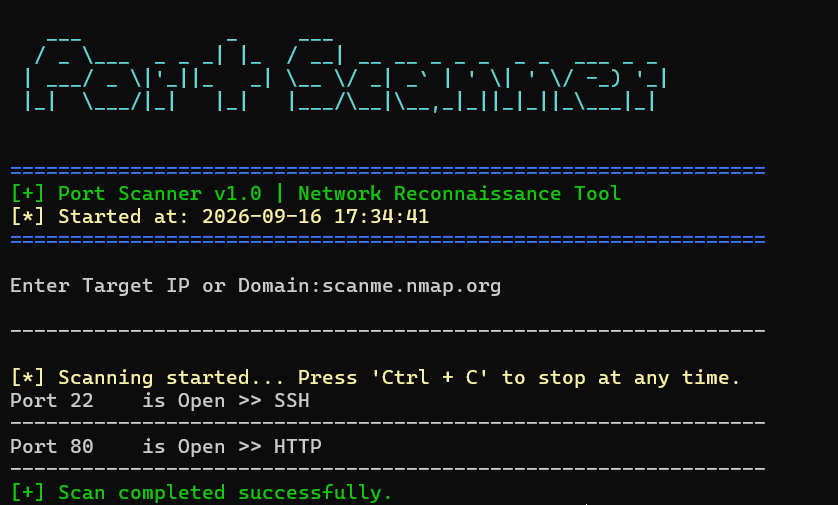

# 🔍 Python Port Scanner

A fast, lightweight, and multi-threaded Command Line Interface (CLI) port scanner written in Python. It includes domain name resolution and basic service detection for open ports.


---

## ✨ Features

* **Multi-threading Support:** Scans multiple ports concurrently for high-speed performance.
* **Domain Resolution:** Accepts both IP addresses and domain names (e.g., `scanme.nmap.org`).
* **Service Detection:** Identifies standard services running on open ports using dictionary lookup.
*  **Clean CLI Output:** Displays active ports clear and concise directly in the terminal.

---

## 📥 Installation & Setup

### 🐧 On Linux / macOS

1. Open your terminal and clone the repository:
```bash
git clone https://github.com/mohammed-ghabayn/port-scanner.git
```

### 🪟 On Windows

1. Open Command Prompt (CMD) or PowerShell and clone the repository:
```bash
git clone https://github.com/mohammed-ghabayn/port-scanner.git
```

## 🚀 Usage

Run the script using Python 3:

```bash
python scanner.py

Enter target IP or Domain: scanme.nmap.org
Enter start port: 20
Enter end port: 100

[+] Target IP: 45.33.32.156
[+] Scanning ports 20 to 100...

Port 22/tcp is OPEN -> SSH
Port 80/tcp is OPEN -> HTTP

Scan completed in 1.45 seconds.
```
## 📜 License

This project is licensed under the MIT License - see the LICENSE file for details.

